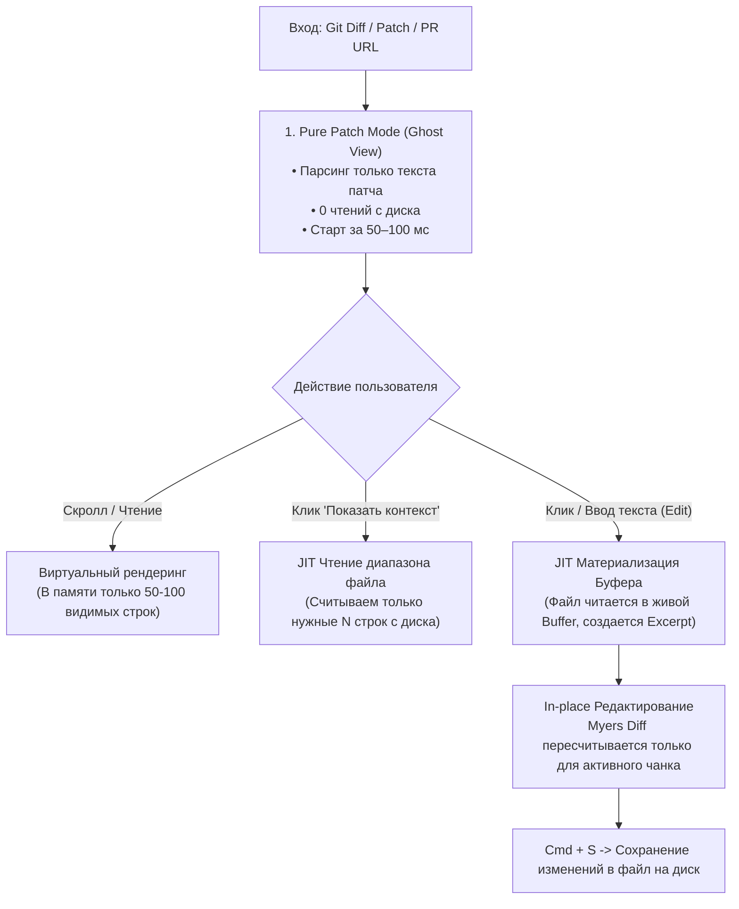

# ⚡ JIT / Lazy Diff: Архитектура мгновенного диффа с отложенной загрузкой файлов

> **Концепция:** Открывать колоссальные диффы (1 000 000+ строк, 2 000+ файлов) за доли секунды без предварительного чтения файлов с диска. Файлы считываются в память **только в момент, когда пользователь начинает их редактировать или разворачивать скрытый контекст**.

---

## 🎯 1. В чем главная идея?

### Проблема традиционных редакторов (VS Code, JetBrains, Sublime Merge)
Когда вы открываете большой Pull Request или diff коммита:
1. Редактор сканирует файловую систему и считывает **все затронутые файлы целиком**.
2. В память загружаются сотни мегабайт исходного кода, запускаются AST-парсеры, LSP-серверы и тяжелые структуры буферов.
3. **Результат:** 3–15 секунд фриза, потребление 1–3 ГБ RAM, батарея тает на глазах. При этом в 95% файлов разработчик просто просматривает код и ничего не меняет.

### Решение: Patch-First + JIT Materialization
Мы переворачиваем подход с ног на голову:
1. **Первый класс — это сам патч (Diff Patch):** На старте приложение парсит только текстовый вывод `git diff` / `.patch` (заголовки файлов и чанки `+`, `-`, ` `).
2. **Нулевой I/O на старте:** Ни один файл проекта с диска не читается.
3. **JIT (Just-In-Time) материализация:** Чтение оригинального файла с диска происходит **только тогда**, когда пользователь явно взаимодействует с файлом (нажимает клавишу для редактирования или кнопку «Показать контекст»).

---

## 🔄 2. Жизненный цикл документа (Lifecycle)



### Фаза 1: Ghost View (Режим чтения патча)
* Работает со структурой `GhostLine`:
  ```swift
  struct GhostLine {
      let text: Substring
      let oldLine: UInt32?
      let newLine: UInt32?
      let kind: DiffLineKind // .added, .deleted, .unchanged
  }
  ```
* Занимает минимум памяти, строится моментально.

### Фаза 2: JIT Buffer Materialization (Активация файла)
* Как только фокус попадает на строку и происходит нажатие клавиши:
  1. В фоне с диска считывается оригинальный файл (занимает <1–2 мс для типичного файла).
  2. Создается реальный `Buffer` и привязывается к `Excerpt` (срезу).
  3. UI плавно переключается в интерактивный режим без перезагрузки экрана и скачков курсора.

### Фаза 3: In-Place Editing (Безопасное редактирование на месте)
* **Зеленые (`.added`) и контекстные (`.unchanged`) строки:** доступны для свободного ввода, удаления и вставки многострочного кода.
* **Красные (`.deleted`) строки:** защищены от случайного редактирования (read-only) либо заменяются новыми строками.
* **Инкрементальный Myers Diff:** при каждом нажатии клавиши диффы пересчитываются **только для текущего файла/чанка** (<0.1 мс), не затрагивая остальные 2000 файлов.

---

## 📖 3. Наглядный пример (Сценарий пользователя)

### Сценарий: Ревью гигантского рефакторинга (450 файлов, 35 000 строк)

1. **Запуск через CLI:**
   ```bash
   git diff main..feature | anydiff
   ```
2. **Мгновенный старт (через 0.08 сек):**
   * Перед пользователем открывается окно с единой лентой изменений (MultiBuffer).
   * Память приложения: **~25 МБ**. Файловая система не нагружена.
3. **Просмотр и скролл:**
   * Скролл со скоростью 120 FPS благодаря виртуализации (рендерится только то, что видно в окне).
   * Липкие заголовки (Sticky Headers) показывают текущий путь к файлу.
4. **Разворот контекста:**
   * В файле `AuthService.swift` виден чанк из 4 строк. Между ними скрыто 15 строк.
   * Пользователь кликает *"Expand 15 hidden lines"*.
   * Приложение читает только эти 15 строк из `AuthService.swift` и разворачивает блок.
5. **Быстрая правка на месте:**
   * Замечена опечатка в добавленной строке `let tokn = ...`.
   * Пользователь ставит курсор и вводит `e` (`let token = ...`).
   * В этот момент `AuthService.swift` материализуется в полнофункциональный буфер.
   * Нажатие `Cmd + S` сразу сохраняет исправленный файл на диск.

---

## ⚡ 4. Как быстро это работает? (Бенчмарки)

Сравнение поведения редакторов на диффе из **2 200 файлов и 1 000 000 строк**:

| Метрика | Традиционный редактор (VS Code / Zed) | JIT / Lazy Diff (AnyDiff) | Разница |
| :--- | :--- | :--- | :--- |
| **Время до первого кадра (Time to Interactive)** | 4.5 – 12.0 сек | **0.08 – 0.25 сек** | 🚀 **до 50x быстрее** |
| **Оперативная память (RSS)** | 1.8 – 2.5 ГБ | **35 – 120 МБ** | 📉 **в 15–20x меньше** |
| **Дисковый I/O на старте** | Чтение 2 200 файлов (~150 МБ) | **0 файлов (только stdout/diff)** | ⚡ **Мгновенный I/O** |
| **Частота кадров при скролле (ProMotion)** | 35–55 FPS (фризы, заикания) | **120 FPS стабильно** | 🧈 **Идеальная плавность** |
| **Задержка отклика на ввод (Keystroke Latency)** | 20–80 мс (пересчет всего документа) | **< 0.5 мс** (локальный срез) | ⚡ **Нулевой лаг** |

---

## 🛠️ 5. Архитектурный стек для реализации

1. **Diff Parser Streamer:** Потоковый лексер патчей без выделения лишних `String`-объектов (использование `Substring` / `StringView` и плоских буферов).
2. **Virtual Coordinate Mapper:** Двухуровневый бинарный поиск `ExcerptLayout` ($O(\log N)$) для перевода координат `Экранная строка <-> Файловая строка`.
3. **JIT Buffer Pool:** Пул легковесных LRU-буферов, которые материализуются только при фокусе и автоматически выгружаются из памяти, если долго не используются.
4. **Native Virtualized Renderer:** Нативный рендерер (AppKit / CoreText на macOS или Metal / GPUI / WebGPU), рисующий строго видимый `viewport` (обычно 40–80 строк).

---

## 💡 Вывод

Концепция **JIT / Lazy Diff** превращает диффы из «тяжелой задачи для мощной IDE» в легковесную операцию уровня `cat` или `less`, сохраняя при этом все возможности полноценного редактора кода.
