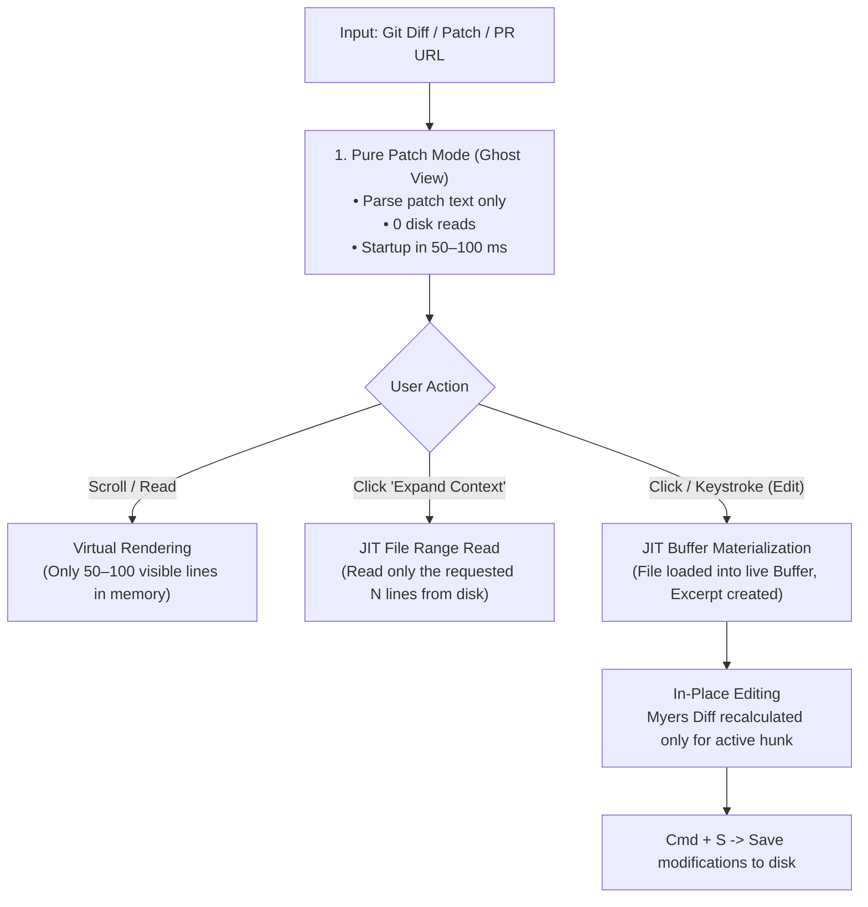

# ⚡ JIT / Lazy Diff: Instant Diff Architecture with Deferred File Loading

> **Core Concept:** Open massive diffs (1,000,000+ lines, 2,000+ files) in fractions of a second without preemptively reading files from disk. Files are materialized into memory **only when the user starts editing them or expands hidden context**.

---

## 🎯 1. Core Motivation

### The Problem with Traditional Editors (VS Code, JetBrains, Sublime Merge)
When opening a large Pull Request or commit diff:
1. The editor scans the filesystem and reads **all affected files in their entirety**.
2. Hundreds of megabytes of source code are loaded into RAM, spinning up AST parsers, LSP servers, and heavy buffer data structures.
3. **Result:** 3–15 second UI freezes, 1–3 GB RAM consumption, and heavy battery drain. In 95% of files, the developer is simply skimming the code without modifying anything.

### The Solution: Patch-First + JIT Materialization
We invert the paradigm:
1. **First-Class Citizens are the Patches:** On launch, the application parses only the textual output of `git diff` / `.patch` (file headers and `+`, `-`, ` ` hunks).
2. **Zero Disk I/O at Startup:** Not a single project source file is read from disk upfront.
3. **Just-In-Time (JIT) Materialization:** Reading the original file from disk occurs **only when** the user explicitly interacts with that specific file (pressing a key to edit or clicking "Expand Context").

---

## 🔄 2. Document Lifecycle



### Phase 1: Ghost View (Patch Reading Mode)
* Operates on a lightweight `GhostLine` structure:
  ```swift
  struct GhostLine {
      let text: Substring
      let oldLine: UInt32?
      let newLine: UInt32?
      let kind: DiffLineKind // .added, .deleted, .unchanged
  }
  ```
* Minimal memory footprint, built near-instantaneously.

### Phase 2: JIT Buffer Materialization (File Activation)
* As soon as a line receives focus and a keystroke occurs:
  1. The original file is read from disk in the background (<1–2 ms for typical files).
  2. A real `Buffer` is created and bound to the corresponding `Excerpt`.
  3. The UI smoothly transitions to interactive editing mode without flickering or cursor jumps.

### Phase 3: Safe In-Place Diff Editing
* **Green added (`.added`) and context (`.unchanged`) lines:** freely editable with typing, deleting, and multiline paste.
* **Red deleted (`.deleted`) lines:** protected against accidental modifications (read-only) or replaced by new insertions.
* **Incremental Myers Diff:** each keystroke recalculates diffs **only for the active file/hunk** (<0.1 ms), leaving the remaining 2,000 files completely untouched.

---

## 📖 3. Practical Example (User Flow)

### Scenario: Reviewing a Giant Refactoring (450 files, 35,000 lines)

1. **Launch via CLI:**
   ```bash
   git diff main..feature | anydiff
   ```
2. **Instant Startup (in 0.08 seconds):**
   * A unified continuous stream of changes (MultiBuffer) opens immediately.
   * Application memory: **~25 MB**. Zero disk I/O load.
3. **Browsing and Scrolling:**
   * Smooth 120 FPS scrolling powered by virtualization (rendering only lines visible on screen).
   * Sticky headers dynamically display the active file path.
4. **Context Expansion:**
   * In `AuthService.swift`, a 4-line hunk is visible with 15 hidden context lines between changes.
   * The user clicks *"Expand 15 hidden lines"*.
   * The app reads only those 15 lines from `AuthService.swift` and expands the slice seamlessly.
5. **Quick In-Place Fix:**
   * A typo is spotted on an added line: `let tokn = ...`.
   * The user places the cursor and types `e` (`let token = ...`).
   * At this instant, `AuthService.swift` materializes into a fully functional editable buffer.
   * Pressing `Cmd + S` immediately persists the fix back to disk.

---

## ⚡ 4. Performance Benchmarks

Behavior comparison on a massive diff consisting of **2,200 files and 1,000,000 lines**:

| Metric | Traditional Editors (VS Code / Zed) | JIT / Lazy Diff (AnyDiff) | Difference |
| :--- | :--- | :--- | :--- |
| **Time to Interactive** | 4.5 – 12.0 s | **0.08 – 0.25 s** | 🚀 **Up to 50x faster** |
| **Resident Memory (RSS)** | 1.8 – 2.5 GB | **35 – 120 MB** | 📉 **15–20x lower memory** |
| **Disk I/O at Startup** | Read 2,200 files (~150 MB) | **0 files (stdout/diff stream only)** | ⚡ **Zero disk I/O** |
| **Scrolling Frame Rate (ProMotion)** | 35–55 FPS (stutters, drops) | **Solid 120 FPS** | 🧈 **Buttery smooth** |
| **Keystroke Latency** | 20–80 ms (document-wide recalculation) | **< 0.5 ms** (localized slice diff) | ⚡ **Zero perceived lag** |

---

## 🛠️ 5. Implementation Architecture

1. **Zero-Copy Diff Streamer:** Streaming patch lexer avoiding unnecessary `String` allocations (utilizing `Substring` / `StringView` and flat line offset buffers).
2. **Virtual Coordinate Mapper:** 2-level binary search layout engine (`ExcerptLayout`, $O(\log N)$) mapping `Viewport Row <-> Buffer Point`.
3. **JIT Buffer Pool:** Lightweight LRU buffer pool that materializes files on demand and unloads idle buffers when memory pressure rises.
4. **Native Virtualized Renderer:** Native renderer (AppKit / CoreText on macOS or Metal / GPUI / WebGPU) rendering strictly the active viewport (typically 40–80 visible lines).

---

## 💡 Summary

The **JIT / Lazy Diff** architecture transforms diff inspection from a heavy, resource-intensive IDE task into an instantaneous, lightweight operation comparable to `cat` or `less`, while preserving all capabilities of a full-featured code editor.
